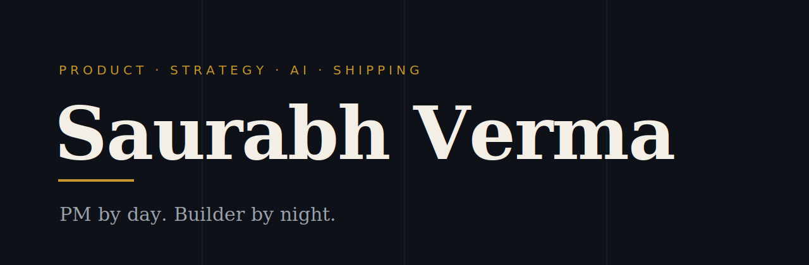

<!--
  jigripokri / jigripokri — GitHub profile README.
  Dark editorial system: ink #0E1117 · ivory #F3EFE6 · amber #C8962C.
  Section visuals are static, self-contained SVGs in /assets (no animations,
  no external services) so they render identically in light and dark themes.
-->

By day, a Product Manager building AI software at scale — currently Partner PM on Microsoft AI, formerly Google. By night and weekend, a builder who loves putzing around with these new superpowers that AI has given us.

Prototypes are not as interesting as learning while shipping production ready software. [Sticky Wicket Labs](https://stickywicketlabs.com) is the playground: weekend builds, no year long roadmaps, no committee reviews.

> My most important user is four years old. He might only want bedtime stories for a few more years — so I build the tools that put him on the page, saving the day alongside the Hulk. That's a user need worth losing sleep over.

| Project | What it does | Type |
|---|---|---|
| [POHA](https://github.com/jigripokri/POHA) | 118 stars. Runs while you sleep, serves a morning brief before your alarm | Agents |
| [KidScribe](https://stickywicketlabs.com) | Personalized books starring your child as the hero | Storytelling |
| [Ugly 2 CEO](https://stickywicketlabs.com) | Turns any photo into a polished, professional portrait | Imaging |
| [Characto](https://stickywicketlabs.com) | Consistent characters across scenes | Creative tools |
| [ELI5](https://stickywicketlabs.com) | Makes the web genuinely easy to read | Learning |
| [DebateGPT](https://stickywicketlabs.com) | Two AI personalities debate any topic | Experiments |
| [Hue Knew?](https://stickywicketlabs.com) | How colors mix to form new ones | Learning |

*Also tinkering with exocortex — a second brain that remembers what matters.*

[stickywicketlabs.com](https://stickywicketlabs.com) · [LinkedIn](https://www.linkedin.com/in/jigripokri/) · [Email](mailto:saurabh@stickywicketlabs.com)

---

*Now go build something.*
